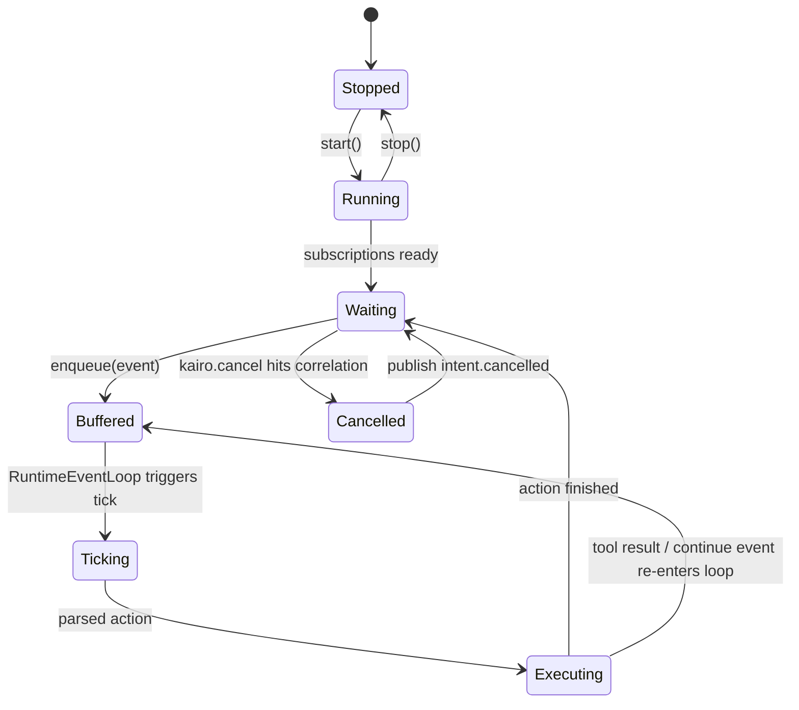

# Kairo AgentRuntime 执行流分析

## 文档目的

本文专门分析 Kairo 中 `AgentRuntime` 的执行机制，重点说明：

1. `AgentRuntime` 如何从事件流中被唤醒。
2. `RuntimeEventLoop` 如何驱动一轮 `tick()`。
3. `tick()` 内部如何构造上下文、调用模型、解析动作并执行。
4. 自动继续、取消、pending action、防循环等控制机制如何协同工作。
5. 当前实现的优势、风险点与后续可演进方向。

本文是对 AgentRuntime 的实现级别解读，不是接口说明。

---

## 一、总体判断

`AgentRuntime` 不是传统意义上的“收到请求 -> 调一次模型 -> 返回文本”的同步处理器。

它更接近一个 **事件驱动的 Agent Actor**：

- 持续订阅事件
- 将事件放入内部缓冲区
- 在合适时机触发一次 `tick()`
- 用当前事件批次构造上下文
- 调用模型得到结构化动作
- 执行动作并发布结果事件
- 必要时自动继续下一轮

因此它的本质是：

> 一个带内部状态、带事件邮箱、带推理循环、带动作生命周期管理的运行时执行体。

---

## 二、AgentRuntime 的组成

`AgentRuntime` 位于：

- `src/domains/agent/runtime.ts`

从实现上看，它主要由以下状态和组件构成：

### 2.1 基础依赖

- `ai`
- `mcp`
- `bus`
- `memory`
- `sharedMemory`
- `vault`

这些决定了 runtime 能访问哪些世界信息与工具。

### 2.2 运行时控制状态

- `running`
- `tickCount`
- `tickHistory`
- `maxTokens`
- `compressionThresholdChars`
- `memorizeIntervalTicks`

这些决定 runtime 如何运转、如何控制上下文大小与记忆节奏。

### 2.3 行为与结果跟踪状态

- `pendingActions`
- `pendingCorrelations`
- `shouldAutoContinue`
- `autoContinueReason`
- `autoContinueStreak`
- `lastSayContent`

这些决定 runtime 如何：

- 识别属于自己的 tool result
- 响应取消
- 控制自动继续
- 防止 say 死循环

### 2.4 组合组件

- `ObservationMapper`
- `RuntimeEventLoop`
- `EventFilter`
- `CancelHandler`
- `ResponseParser`
- `ToolDispatcher`
- `ActionExecutor`
- `SayLoopGuard`

这种组合式结构说明，runtime 被设计成一个“组件编排器”，而不是一个大而全的单函数对象。

---

## 三、启动阶段：AgentRuntime 如何进入运行态

### 3.1 `start()` 的职责

`start()` 主要做三件事：

1. 将 runtime 标记为运行中。
2. 订阅相关事件。
3. 广播自身 capabilities。

关键订阅包括：

- `kairo.tool.result`
- `kairo.user.message`
- `kairo.agent.{id}.message`
- `kairo.system.>`
- `kairo.agent.internal.>`
- `kairo.cancel`
- `kairo.agent.{id}.task`

这说明 runtime 并不是只吃用户消息，它可以被以下事件唤醒：

- 用户输入
- 工具结果回流
- 系统通知
- 内部继续信号
- 任务委派事件

### 3.2 capability 广播

如果 runtime 有 capability 声明，则在启动时广播：

- `kairo.agent.capability`

这为 collaboration 层提供了“能力发现”基础。

也就是说，runtime 不只是被动执行，还会主动对外公布“我能做什么”。

---

## 四、输入阶段：事件如何进入 runtime

### 4.1 `handleEvent()` 不是直接执行，而是先过滤

runtime 收到事件后，并不会立刻进入模型推理。它先经过：

- `EventFilter.accept(event)`

只有通过过滤的事件，才会被送入：

- `RuntimeEventLoop.enqueue(event)`

这种设计把：

- 事件接收
- 事件过滤
- 事件执行

三者解耦了。

### 4.2 为什么 `EventFilter` 非常关键

`EventFilter` 当前有两个核心作用：

#### A. 过滤 tool result 的归属

只有当：

- `event.type === "kairo.tool.result"`
- 且 `event.causationId` 命中当前 runtime 的 `pendingActions`

这个 tool result 才会被当前 runtime 接收。

这样可以防止：

- 多个 agent 共享总线时，互相误消费别人的工具结果。

#### B. 过滤定向用户消息

当 `kairo.user.message` 带有 `targetAgentId` 时，如果目标不是当前 agent，则直接忽略。

这样可以保证：

- 全局用户消息仍可广播
- 但 agent 可以只消费针对自己的消息

### 4.3 取消事件单独处理

`kairo.cancel` 不经过普通 `handleEvent()` 路径，而是进入：

- `handleCancel()`
- `CancelHandler.handle(event)`

这说明取消被视为一种特殊控制语义，而不是普通 observation。

---

## 五、RuntimeEventLoop：为什么 runtime 不是“来一条处理一条”

### 5.1 事件循环的意义

`RuntimeEventLoop` 的价值在于：

- 缓冲事件
- 限制缓冲上限
- 串行调度 tick
- 在 tick 完成后决定是否继续

没有这一层，runtime 会退化成：

- 每收到一个事件，就同步触发一次模型调用

那样会带来很多问题：

- 并发推理冲突
- 事件风暴下的重复推理
- 无法批量消费关联事件
- 长任务推进时的节奏失控

### 5.2 它让 runtime 更接近 actor 模型

有了 event loop，runtime 就具备了下面这些 actor 风格特征：

- 自己有事件邮箱
- 自己决定何时处理下一批事件
- 自己维护内部状态
- 不直接暴露内部调用栈给外部

这对 agent 非常重要，因为 agent 并不是无状态 RPC 组件。

### 5.3 finally 阶段的 auto-continue

从事件循环实现可以看出，tick 执行完成后，在 `finally` 阶段会读取：

- `consumeAutoContinueReason()`

如果有继续原因，则异步发布内部继续事件。

这一设计意味着：

- 自动继续不是散落在各处分支中的 side effect
- 而是作为 event loop 的统一后处理机制存在

这是比较干净的控制流设计。

---

## 六、`tick()`：一轮推理的完整执行链路

`tick()` 是 runtime 的核心执行函数。它可以拆成若干明确阶段。

### 6.1 阶段 A：从事件批次构造上下文

`tick(events)` 首先调用：

- `buildTickContext()`

它负责：

1. 将 `KairoEvent[]` 映射成 `Observation[]`
2. 获取短期上下文 `memory.getContext()`
3. 在必要时触发 `memory.compress(ai)`
4. 收集当前 system tools
5. 从 MCP 获取相关工具
6. 基于近期 observation 做长期记忆召回
7. 构造 `systemPrompt`
8. 构造 `userPrompt`
9. 提取当前轮的 `correlationId / causationId`

换句话说，`tick()` 的第一步不是调模型，而是把“世界当前发生了什么”翻译成模型可消费的上下文材料。

### 6.2 阶段 B：决定本轮是否值得推理

如果 `buildTickContext()` 返回 `null`，即没有有效 observations，则本轮直接跳过。

这个设计很重要，因为它说明 runtime 不是“见事件必推理”，而是“只有当事件能形成有效 observation 时才推理”。

### 6.3 阶段 C：调用 AI 模型

有了 `systemPrompt + userPrompt` 后，runtime 才真正调用模型。

这里有一个关键设计假设：

- 模型不是返回自然语言最终答案
- 模型是返回一个结构化决策结果

也就是：

- `thought`
- `action`

这决定了整个 runtime 的后续结构。

### 6.4 阶段 D：通过 `ResponseParser` 恢复协议

模型返回之后，runtime 不会直接相信内容，而是交给：

- `ResponseParser.parse(response.content)`

这个 parser 的恢复路径相当完整：

1. 先直接解析 JSON
2. 再尝试从文本中提取 JSON 候选
3. 再尝试修复截断 JSON
4. 若仍失败，降级成一个自动纠错的 `say` 动作

这说明 runtime 已经把“模型不守协议”视为常见情况，而不是异常边缘情况。

### 6.5 阶段 E：行为守护

parser 得到 action 后，runtime 还会做额外控制，例如：

- 重复 say 检测
- fallback say 长度控制
- auto-continue 语义规范化

这意味着 runtime 不是一个被动解释器，而是一个主动约束模型行为的执行环境。

### 6.6 阶段 F：发布 thought / action 事件

runtime 会把模型生成的 thought 和 action 作为系统事件发布出去。

这样其他系统就能观察到：

- 当前 agent 想了什么
- 当前 agent 决定做什么

这些信息会被以下模块消费：

- Server / WebSocket 广播
- ReviewAgent
- Task adapter
- observability / tracing

### 6.7 阶段 G：交给 `ActionExecutor` 执行动作

动作执行不是直接在 `tick()` 里手写完成，而是统一交给：

- `ActionExecutor.execute(...)`

这样 `tick()` 负责“决定做什么”，而 executor 负责“如何做”。

### 6.8 阶段 H：将本轮轨迹写入 memory

在 action 执行之后，runtime 会将本轮的：

- observation
- thought
- action
- actionResult

写入短期记忆。

这一步非常重要，因为：

- 下一轮的 `memory.getContext()` 就依赖这次写入
- runtime 形成了自我连续性

### 6.9 阶段 I：决定是否 auto-continue

本轮结束后，如果 action 或状态机要求继续，则 event loop 的 finally 阶段会发布内部继续事件。

所以 `tick()` 并不是默认“一轮结束就停”，而是会根据动作语义决定要不要进入下一轮。

---

## 七、ResponseParser：模型协议容错层

### 7.1 为什么 parser 这么重要

Kairo 的 runtime 要求模型输出严格 JSON，这是必要的，但现实里模型很可能会：

- 带 markdown code fence
- 夹杂解释性文本
- 输出一段近似 JSON
- 输出被截断 JSON
- 缺少 `thought`
- 缺少合法 `action`

因此 `ResponseParser` 承担的其实不是“解析 JSON”这么简单，而是：

> 把不稳定的模型输出，尽可能恢复成 runtime 能执行的协议对象。

### 7.2 当前 parser 的恢复链路

parser 当前大致提供三层恢复：

1. **直接解析**
   - 清理 code fence 后直接 `JSON.parse`
2. **候选片段提取**
   - 从混杂文本中提取最像 JSON 的对象片段
3. **截断修复**
   - 尝试补全括号与字符串闭合

如果这些都失败，则降级为：

- `say("响应格式错误，正在自动纠正并重试。", continue=true)`

这是一个典型的 runtime 级自我修正手段。

### 7.3 parser 的架构意义

这意味着 Kairo 在设计上已经承认：

- prompt engineering 永远不够
- 必须用 protocol recovery 去约束 LLM 输出

这是一种比较成熟的 agent runtime 思路。

---

## 八、ActionExecutor：动作生命周期控制器

### 8.1 它的角色不是“帮忙调工具”

`ActionExecutor` 的真正职责是管理动作生命周期，包括：

- 发布 action 事件
- 启动 intent
- 跟踪 pending action
- 调 tool dispatcher
- 发布 tool result
- 发布 intent end
- 在失败时转化为标准错误事件

它更像一个 **Action Transaction Coordinator**。

### 8.2 tool_call 的关键流程

当 action 是 `tool_call` 时，executor 会：

1. 发布 `kairo.agent.action`
2. 记录 `actionEventId`
3. 将 `actionEventId` 加入 `pendingActions`
4. 将 `actionEventId -> correlationId` 加入 `pendingCorrelations`
5. 调用 `dispatchToolCall`
6. 发布 `kairo.tool.result`
7. 发布 `kairo.intent.ended`

这样后续任何 tool result 回流时，runtime 都能知道：

- 这是哪次动作导致的
- 应该归属于哪个 agent
- 如果用户取消，应取消哪一组相关动作

### 8.3 对系统的价值

这一层把“动作执行”变成了一个有因果链的事件系统，而不是普通函数调用。

这使得系统能够支持：

- action trace
- tool result ownership
- cancellation by correlationId
- debug / replay / observability

---

## 九、ToolDispatcher：能力统一分发层

### 9.1 为什么要有 dispatcher

从 runtime 视角看，模型只会说：

- “我要调用 `tool_name`，参数如下”

它不应该关心：

- 这个工具是 agent 原生 system tool
- 还是 MCP 工具
- 是否需要 vault 支持
- 是否需要 trace context

这就是 `ToolDispatcher` 的职责所在。

### 9.2 它在架构中的位置

位置关系可以理解为：

- `tick()` 负责生成 action
- `ActionExecutor` 负责动作生命周期
- `ToolDispatcher` 负责真正的能力路由

这三层分工很清楚，也让工具系统具有很强的可扩展性。

---

## 十、自动继续：runtime 具备“持续工作能力”的关键

### 10.1 auto-continue 的意义

如果没有 auto-continue，runtime 每轮执行后都只能等待外部新事件。

有了 auto-continue 后，agent 可以形成：

- 说一句进度
- 自动继续下一轮
- 再做一步
- 再继续

这对下列场景非常重要：

- 长程任务
- 多步工具编排
- 自主推进工作流
- task agent 的后台执行

### 10.2 当前机制如何工作

当前设计里：

- action 可以带 `continue: true`
- runtime 会记录继续原因
- event loop 的 finally 阶段统一发布内部继续事件

因此 auto-continue 并不是某个 action 内部直接递归调用下一轮，而是通过事件机制再次唤醒 runtime。

这个设计比同步递归推进更稳健，因为它：

- 保持了事件驱动模型一致性
- 避免直接深度递归
- 让每轮继续仍然可观察、可取消、可追踪

### 10.3 它的风险点

auto-continue 同时也是一把双刃剑。

如果控制不严，就可能出现：

- 无意义持续推进
- 反复 say 同样内容
- 在没有新增有效世界状态的情况下反复自激活

因此必须和：

- `SayLoopGuard`
- `autoContinueStreak`
- task progress / review 机制

搭配使用。

---

## 十一、SayLoopGuard：最基础的运行时防呆

### 11.1 它防的是什么

LLM 很容易在 agent 场景下出现这种问题：

- 不断重复一模一样的 say
- 自我鼓励式继续
- 进入“我马上处理 / 正在处理 / 继续处理中”循环

`SayLoopGuard` 的目标就是识别这种低质量循环。

### 11.2 当前做法

当前实现非常直接：

- 如果 action 不是 `say`，就重置状态
- 如果 action 是 `say`，则对内容归一化
- 若连续若干轮 say 内容相同，则视为循环风险

这是一个简单但有效的 runtime guard。

### 11.3 架构意义

这个 guard 非常能体现 Kairo 的设计风格：

- 不把所有正确性都寄托在 prompt 上
- 而是在 runtime 层加行为约束

这种思路是 agent 系统走向可靠性的关键。

---

## 十二、CancelHandler：基于因果链的取消机制

### 12.1 取消不是“终止线程”，而是撤销语义链路

Kairo 的取消设计不是传统同步程序中的“中断函数执行”，而是：

- 收到 `kairo.cancel`
- 根据 `targetCorrelationId` 找到命中的 pending action
- 从 pending 集合中移除
- 发布 `kairo.intent.cancelled`

这说明取消在这里是：

- 基于 correlation 语义的取消
- 基于事件链的取消

### 12.2 为什么这种方式合理

在事件驱动 agent 中：

- 一次动作可能触发异步工具
- 工具结果可能在未来某个时刻回流
- runtime 与工具之间不是同步阻塞调用

因此取消最自然的实现方式就是：

- “让这条因果链不再被认为有效”

而不是试图直接 kill 某个同步调用栈。

---

## 十三、状态流转图

下面给出一个高层状态图，帮助理解 runtime 的主流程。



这个图想表达的是：

- runtime 常态不是一直“在推理”
- runtime 更多时候在等待事件
- 事件进入后先缓冲，再进入 tick
- 动作执行结束后回到等待态
- continue 或 tool result 会让其再次进入下一轮

---

## 十四、典型时序图：一轮 tool_call 如何闭环

```mermaid
sequenceDiagram
    participant Bus as EventBus
    participant RT as AgentRuntime
    participant Loop as RuntimeEventLoop
    participant AI as AIProvider
    participant Parser as ResponseParser
    participant Exec as ActionExecutor
    participant Disp as ToolDispatcher

    Bus->>RT: kairo.agent.default.message
    RT->>RT: EventFilter.accept()
    RT->>Loop: enqueue(event)
    Loop->>RT: tick(events)
    RT->>RT: buildTickContext()
    RT->>AI: chat(systemPrompt, userPrompt)
    AI-->>RT: model response
    RT->>Parser: parse(response)
    Parser-->>RT: thought + action
    RT->>Bus: publish kairo.agent.thought
    RT->>Exec: execute(action)
    Exec->>Bus: publish kairo.agent.action
    Exec->>Disp: dispatchToolCall()
    Disp-->>Exec: tool result
    Exec->>Bus: publish kairo.tool.result
    Exec->>Bus: publish kairo.intent.ended
    RT->>RT: memory.update(...)
```

这个图体现了一个关键事实：

- tool_call 并不是 runtime 内部的私有动作
- 整个动作生命周期都被事件化并暴露给系统其他部分

---

## 十五、典型时序图：auto-continue 如何发生

```mermaid
sequenceDiagram
    participant RT as AgentRuntime
    participant Loop as RuntimeEventLoop
    participant Exec as ActionExecutor
    participant Bus as EventBus

    Loop->>RT: tick(events)
    RT->>Exec: execute(say with continue)
    Exec-->>RT: actionResult
    RT->>RT: memory.update(...)
    Loop->>Loop: finally consumeAutoContinueReason()
    Loop->>Bus: publish kairo.agent.internal.continue
    Bus->>RT: kairo.agent.internal.continue
    RT->>Loop: enqueue(event)
    Loop->>RT: next tick()
```

这个机制说明：

- “继续下一轮”并不是函数递归
- 而是通过重新发布内部事件来实现

这保持了 runtime 的统一事件驱动风格。

---

## 十六、这套执行流的优点

### 16.1 模型与系统解耦清晰

模型负责：

- 产出结构化决策

runtime 负责：

- 执行决策
- 管理状态
- 纠偏和约束

这比把模型输出直接映射到系统副作用更安全。

### 16.2 事件是一等公民

从输入到输出再到工具结果，几乎所有关键步骤都被事件化了。这使得：

- 可观测性更强
- 扩展性更好
- review / server / task 可以旁路监听

### 16.3 对模型不稳定性有一定容错

parser 恢复、say loop guard、cancel handler、pending action tracking 都是运行时层面的稳定器。

### 16.4 为长期运行准备了基础设施

auto-continue、memory compression、task delegation、checkpoint / review 子系统都说明这不是一次性对话 agent，而是打算让 agent 能持续工作的设计。

---

## 十七、当前执行流的风险点

### 17.1 `tick()` 仍是高复杂度中心

虽然 runtime 已经拆分出多个组件，但 `tick()` 仍然是：

- 上下文构造
- 模型调用
- 解析
- 动作守护
- 执行
- 记忆更新
- 自动继续判定

的汇聚点。

随着系统复杂度上升，它很可能继续变得更重，未来可能需要进一步拆成更清晰的 orchestration stages。

### 17.2 事件调试仍然依赖良好 tracing

当前设计很强依赖：

- event name
- correlationId
- causationId
- pendingActions

如果 tracing 工具不足，排查“为什么没进入下一轮”“为什么 tool result 被忽略”会比较困难。

### 17.3 auto-continue 是收益点也是风险点

它让 agent 可以持续工作，但也会带来：

- 无效循环
- 空推进
- 过度自激活

因此 future version 很值得进一步加强：

- continue 预算
- progress-aware continue
- stagnation 检测
- 基于状态的 stop 条件

### 17.4 parser 兜底虽实用，但也可能掩盖问题

当前 parser 的自我纠错逻辑能提高稳定性，但如果模型长期输出不合规，系统可能陷入“不断 say 自我纠正”的隐形低效状态。

这意味着后续可能需要：

- parser error metrics
- response contract health monitoring
- adaptive retry / fallback provider 策略

---

## 十八、我对 AgentRuntime 的总体定位

如果要给 `AgentRuntime` 一个明确定位，我会这样描述：

> `AgentRuntime` 是 Kairo Agent 体系中的单实例执行内核。它将事件流转化为 observation，将 observation 转化为 prompt，将模型响应转化为结构化动作，再通过动作生命周期管理把结果重新回流到系统中。它不是简单的对话处理器，而是一个带状态、带调度、带容错、带治理意识的 Agent Actor Runtime。

这也是为什么整个 Kairo 项目会更像一个“本地 Agent 内核”，而不是普通聊天后端。

---

## 十九、后续最值得继续深挖的方向

基于当前理解，下一步最值得继续深入的方向有两个：

### 方向 A：Task Agent 如何借助 runtime 持续推进长任务

重点可分析：

- `TaskAgentManager`
- `TaskAgentRuntimeAdapter`
- `auto-continue`
- `TaskOrchestrator`
- `CheckpointManager`

这会解释 Kairo 为什么不仅能“对话”，还能“后台做事”。

### 方向 B：Review 与 Runtime 如何形成闭环治理

重点可分析：

- `ReviewAgent`
- `kairo.review.requested`
- `finish` 行为的审查时机
- artifact verification / git diff 校验
- 完成声明与真实完成的分离机制

这会解释 Kairo 为什么比普通 agent 更强调“可靠性”。

---

## 二十、结语

`AgentRuntime` 这一层是 Kairo 设计里最值得认真读的部分，因为它体现了整套系统的真正哲学：

- 模型只是决策引擎
- runtime 才是行为控制中心
- 事件流才是系统真正的血液循环
- 可靠性需要在运行时层面治理，而不是只靠 prompt

这也是 Kairo 能从“能跑 LLM”走向“能跑 Agent Runtime”的关键。
