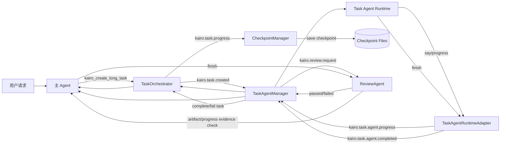
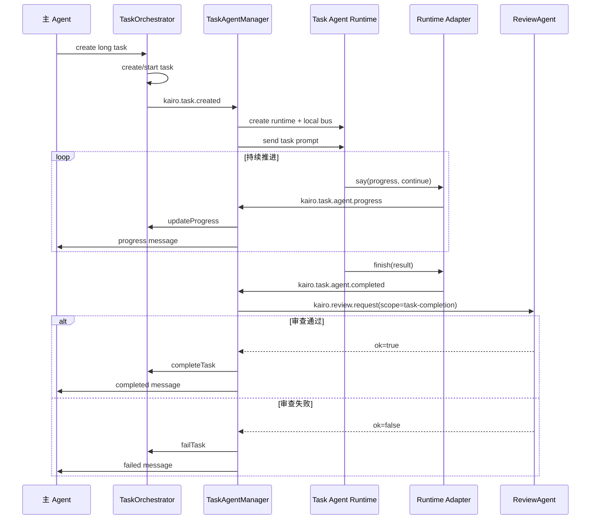
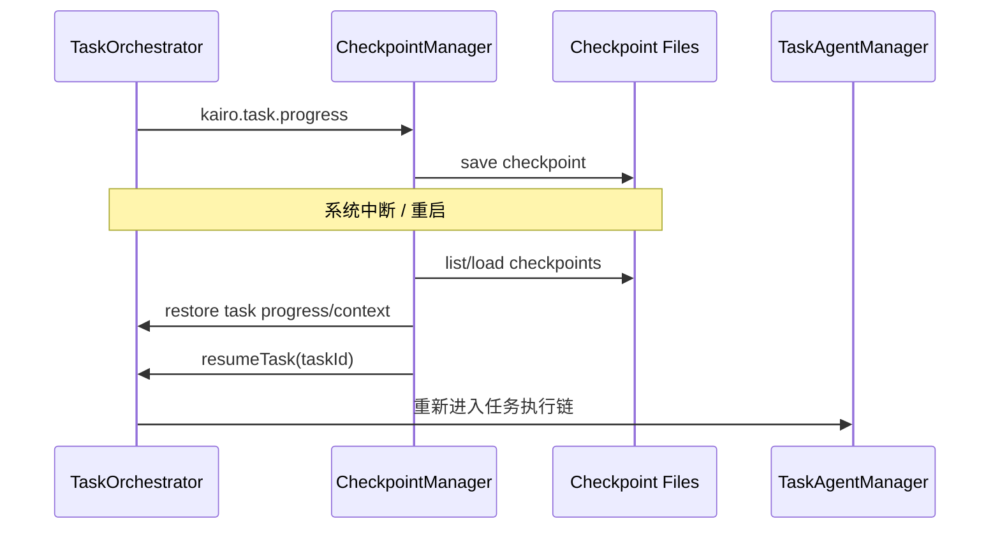

# Kairo 长任务治理闭环分析

## 文档目的

本文从系统视角串联 Kairo 中的 `Task Agent` 与 `ReviewAgent`，分析当前长任务是如何完成以下闭环的：

1. 主 Agent 识别并创建长任务。
2. `TaskOrchestrator` 将任务结构化并状态化。
3. `TaskAgentManager` 创建专职 Task Agent 后台执行任务。
4. `TaskAgentRuntimeAdapter` 将 Task Agent 的行为翻译为任务进度与完成事件。
5. `CheckpointManager` 为长任务提供中断恢复能力。
6. `ReviewAgent` 对完成声明进行审查，避免“误报已完成”。
7. 最终让“长任务执行”与“长任务可信完成”形成一个完整治理闭环。

本文不只关注任务如何“跑起来”，更关注任务如何“被治理”。

---

## 一、总体判断

Kairo 的长任务设计并不是简单的：

- 主 Agent 收到复杂请求
- 自己后台慢慢继续做

它更接近这样一个架构：

- **主 Agent 负责识别长任务并发起委派**
- **Task Agent 负责专职执行长任务**
- **TaskOrchestrator 负责管理任务生命周期**
- **CheckpointManager 负责恢复能力**
- **ReviewAgent 负责完成声明审查**

因此它形成的不是单纯“执行链”，而是：

> 一条从任务创建、任务执行、进度回流、检查点保存，到完成审查与最终结案的治理闭环。

---

## 二、闭环里的核心角色

### 2.1 主 Agent

主 Agent 的职责不是亲自长期执行所有工作，而是：

- 识别某件事适合转成长任务
- 调用任务工具创建任务
- 向用户说明任务已进入后台执行
- 在 Task Agent 回报进度或结果时继续承担对外沟通角色

它是：

- **任务发起者**
- **用户交互窗口**
- **上游协调者**

### 2.2 TaskOrchestrator

`TaskOrchestrator` 是长任务的状态机中心，负责：

- 创建任务
- 启动任务
- 更新进度
- 暂停 / 恢复
- 完成 / 失败 / 取消
- 发出任务生命周期事件

它是：

- **任务事实源（source of truth）**

### 2.3 TaskAgentManager

`TaskAgentManager` 负责：

- 监听长任务创建事件
- 创建专属 Task Agent
- 为其配置独立 local bus
- 启动 runtime
- 接收 progress / noop / completed 事件
- 将 Task Agent 的行为重新映射回主系统

它是：

- **Task Agent 生命周期管理器**
- **局部运行时与全局任务系统之间的桥梁**

### 2.4 TaskAgentRuntimeAdapter

它将 Task Agent 的 runtime action 翻译为任务语义：

- `say` → 进度报告
- `finish` → 完成声明
- `noop` → 当前无法推进状态

它是：

- **通用 Runtime 到任务域的语义适配层**

### 2.5 CheckpointManager

它负责：

- 在进度达到 checkpoint milestone 时保存检查点
- 在任务结束时删除检查点
- 系统重启后恢复未完成任务

它是：

- **长任务的恢复与持久化保障层**

### 2.6 ReviewAgent

它负责：

- 对 task completion 做状态一致性审查
- 对主 Agent finish 做产物证据审查
- 发布 `passed / failed` verdict

它是：

- **完成声明治理层**

---

## 三、为什么需要 Task Agent + ReviewAgent 两层

从系统设计角度，Task Agent 与 ReviewAgent 分别解决两个完全不同的问题：

### 3.1 Task Agent 解决“执行问题”

它要回答：

- 如何让长任务不阻塞主 Agent？
- 如何让一个任务持续推进很多轮？
- 如何让进度可回传？
- 如何在后台独立工作？

### 3.2 ReviewAgent 解决“可信问题”

它要回答：

- Task Agent 说完成了，能不能信？
- 主 Agent 说已经交付了，证据在哪？
- 任务真的达到总进度了吗？
- 产物路径是否存在、是否真的发生了变化？

所以这两层缺一不可：

- 没有 Task Agent，长任务执行力不够
- 没有 ReviewAgent，长任务可信度不够

一个管“能做”，一个管“做得算不算数”。

---

## 四、闭环第一段：主 Agent 如何把请求转成长任务

### 4.1 长任务入口是系统工具

Kairo 通过 `AgentTaskTools` 注册任务相关工具：

- `kairo_create_long_task`
- `kairo_query_task_status`
- `kairo_cancel_task`

这意味着：

- 主 Agent 并不是直接 new 一个 task object
- 而是通过统一的工具调用接口创建长任务

这种做法的意义是：

- 任务系统能力被正式纳入 agent tool universe
- 主 Agent 与 Task 系统之间保持统一交互模式

### 4.2 创建长任务时发生了什么

`kairo_create_long_task` 主要会：

1. 创建 `Task`
2. 标记 `type = LONG`
3. 写入描述、步骤数、上下文
4. 启用 `autoResume`
5. 配置 checkpoint interval
6. 调用 `orchestrator.startTask()`
7. 初始化 progress

然后 `TaskOrchestrator` 会发布：

- `kairo.task.created`
- `kairo.task.started`
- `kairo.task.progress`

这意味着任务一旦被创建，就已经成为系统中的正式状态实体，而不是“Agent 心里记着的一件事”。

---

## 五、闭环第二段：TaskAgentManager 如何孵化专职执行者

### 5.1 TaskAgentManager 监听长任务创建事件

`TaskAgentManager` 订阅：

- `kairo.task.created`
- `kairo.task.cancelled`

当它看到一个 `LONG` 类型任务时，就会创建专门的 Task Agent。

### 5.2 为什么每个 Task Agent 都有自己的 local bus

Task Agent 创建时，会新建：

- `InMemoryGlobalBus`
- `TaskAgentLocalEventStore`

然后 Task Agent Runtime 绑定在这个 local bus 上。

这意味着 Task Agent 不是直接跑在主 EventBus 上，而是处在一个相对隔离的小运行环境中。

其好处是：

- 降低全局事件噪声
- 让 task agent 只关注自己任务相关的输入
- 形成更清晰的 worker-like 运行边界
- 便于局部记录 task agent 事件历史

### 5.3 Task Agent 如何被启动

TaskAgentManager 会：

1. 调用 runtime factory 生成 `AgentRuntime`
2. 调 `runtime.start()`
3. 向 local bus 发布一条 `kairo.agent.{taskAgentId}.message`
4. 内容是 `buildTaskAgentPrompt(task)` 生成的任务提示

这说明 Task Agent 的启动方式不是专门的 task API，而是：

- “向一个通用 AgentRuntime 发一条任务型消息”

这使 Task Agent 仍然复用了主 Runtime 框架，而不是搞出第二套 runtime。

---

## 六、闭环第三段：Task Agent 如何持续推进任务

### 6.1 TaskAgentPrompt 重写了 Runtime 的工作模式

TaskAgentPrompt 里明确告诉 Task Agent：

- 你是一个专门执行长程任务的 Agent
- 专注当前任务，不要被别的事干扰
- 定期汇报进度
- 不等待用户确认
- 使用 `say + continue`
- 直到完成再 `finish`

这实际上是在通用 Runtime 上叠加一个新的执行人格：

- 主 Agent 偏交互与协调
- Task Agent 偏后台执行与持续推进

### 6.2 Task Agent 持续推进的关键：auto-continue

Task Agent 能持续工作的核心，不在 TaskManager，而在底层 `AgentRuntime` 本身。

因为 runtime 支持：

- action 带 `continue: true`
- event loop finally 阶段重新发布 continue 事件

所以 Task Agent 可以形成循环：

1. 推理一轮
2. 做一步事
3. `say` 报告进度
4. 设置 `continue: true`
5. runtime 自动进入下一轮
6. 直到 `finish`

因此：

- TaskAgentPrompt 负责告诉模型“要持续推进”
- `AgentRuntime` 负责提供真正的持续执行机制

这两层叠起来，Task Agent 才能像后台 worker 一样运行。

---

## 七、闭环第四段：TaskAgentRuntimeAdapter 如何把 Runtime 行为翻译成任务语义

### 7.1 为什么需要 adapter

Task Agent 底层仍然是通用 `AgentRuntime`，而通用 runtime 只知道：

- `say`
- `tool_call`
- `finish`
- `noop`

但任务系统要的是：

- 任务进度
- 任务完成
- 任务暂时无法推进

所以需要一个中间层，把通用 action 翻译成任务事件。

### 7.2 adapter 当前做了什么

它通过拦截 runtime 的 `onAction`：

- `say` → 提取进度 → 发布 `kairo.task.agent.progress`
- `finish` → 发布 `kairo.task.agent.completed`
- `noop` → 发布 `kairo.task.agent.noop`

这意味着 Task Agent 不需要一套专门的 task runtime，只要给现有 runtime 套一个适配层即可。

### 7.3 进度提取的特点

当前进度提取是启发式正则匹配，例如：

- `X/Y`
- `第 X 步`
- `completed X of Y`

这是一种很工程实用的方案，但也意味着：

- 进度质量仍依赖模型输出格式相对稳定

所以这里是一个“prompt + adapter”双重契约，而不是强结构化协议。

---

## 八、闭环第五段：进度如何从 Task Agent 回流到主系统

### 8.1 progress 先进入 local bus

TaskAgentRuntimeAdapter 会先向 local bus 发布：

- `kairo.task.agent.progress`

### 8.2 TaskAgentManager 消费并更新 TaskOrchestrator

`TaskAgentManager.handleTaskAgentProgress()` 收到后，会：

- 更新任务状态机的 progress
- 记录 `lastProgressReport`

这样 task 的事实状态被正式写回到了系统任务表述里。

### 8.3 再转发给主 Agent

随后 `TaskAgentManager` 会向主 Agent 发布：

- `kairo.agent.{parentAgentId}.message`

内容类似：

- `[Task Agent 进度] ...`

这一步非常重要，因为它让：

- 后台执行状态可见
- 用户可感知任务进展
- 主 Agent 可以把 Task Agent 的进度继续纳入自己的上下文与对外解释

所以 progress 回流是双重的：

- 回到任务状态机
- 回到主 Agent 的交互流

---

## 九、闭环第六段：CheckpointManager 如何提供恢复能力

### 9.1 为什么长任务必须有 checkpoint

长任务可能跨很多轮执行，因此天然会遇到：

- Runtime 崩溃
- 进程重启
- 外部中断
- 长时间任务推进

如果没有 checkpoint，任务会变成一次性内存状态，系统稳定性很差。

### 9.2 checkpoint 的触发条件

`CheckpointManager` 监听：

- `kairo.task.progress`

当：

- `task.config.checkpointInterval` 存在
- 且 `progress.current % checkpointInterval === 0`

则自动保存检查点。

### 9.3 checkpoint 保存了什么

检查点内容包括：

- `taskId`
- `timestamp`
- `progress`
- `context`
- `metadata`

这说明当前 checkpoint 恢复的是：

- 任务状态
- 任务上下文

而不是完整的 Runtime 内部执行栈。

### 9.4 恢复逻辑

恢复时会：

1. 读取 checkpoint 文件
2. 找到 task
3. 恢复 progress/context
4. 发布 `kairo.task.checkpoint.restored`
5. `orchestrator.resumeTask(taskId)`

这意味着 Kairo 当前更像：

- **从任务状态恢复**

而不是：

- **从 agent 推理现场精确恢复**

但对第一阶段长任务系统来说，这已经非常有价值。

---

## 十、闭环第七段：Task Agent 完成后为什么不能直接算完成

### 10.1 `finish` 只是 Task Agent 的声明

TaskAgentRuntimeAdapter 在看到 `finish` 时，只会发布：

- `kairo.task.agent.completed`

它不会直接把任务改成 completed。

这点特别重要，因为它说明系统从设计上就承认：

- Task Agent 说完成了，不代表任务就一定完成了

### 10.2 TaskAgentManager 接手完成事件

`handleTaskAgentCompleted()` 收到完成事件后，会：

1. 提取 `result / error`
2. 若启用 review，则调用 `requestTaskCompletionReview()`
3. 若 review 失败或有 error：
   - `orchestrator.failTask()`
4. 否则：
   - `orchestrator.completeTask()`
5. 向主 Agent 回传成功/失败消息
6. 停止并回收 task agent

这个逻辑体现了一个关键治理原则：

> 完成状态的最终决定权不在 Task Agent，而在任务管理层。

---

## 十一、闭环第八段：ReviewAgent 如何给长任务加上“可信完成”约束

### 11.1 Task review 的触发方式

TaskAgentManager 在 task 完成时，通过 request-response 语义发出：

- `kairo.review.request`

其中：

- `scope = task-completion`
- 带 `taskId`
- 带 `taskAgentId`
- 带 `result`

ReviewAgent 收到后会：

- evaluate
- 返回 `kairo.review.response`
- 同时发布 `kairo.review.passed / failed`

### 11.2 当前 task review 审查什么

当前 `task-completion` 的规则是偏状态一致性的：

- task 是否存在
- task 是否被取消
- progress 是否达到 total

它现在不深究“内容质量”，而是先保证：

- 一个还没跑满进度的 task agent 不能轻易 claim 完成

这是一个很合理的 MVP 路线。

### 11.3 为什么这层 review 很重要

如果没有 review，则长任务系统容易出现：

- agent 中途提前 finish
- 实际还没跑完 total steps
- 上游主 Agent 却已经告诉用户“完成了”

Review 层至少阻止了这类最常见误判。

---

## 十二、闭环第九段：主 Agent 也在同一个治理闭环里

这里最值得注意的一点是：

- ReviewAgent 不只审 Task Agent
- 它也审主 Agent 自己的 `finish`

具体逻辑是：

1. 监听 `kairo.agent.action`
2. 记录最近 `say`
3. 看到 `finish` 就自动发起 `agent-finish` review
4. 校验：
   - finish 是否为空
   - 最近 say 是否承诺了产物
   - claim 中是否提供了证据
   - 路径是否存在
   - workspace 内路径是否真的 changed

这意味着长任务闭环不是只治理“后台 worker”，而是连上游的主 Agent 也纳入了同一条完成治理链中。

所以真正的闭环是：

- Task Agent 的完成声明要被 review
- 主 Agent 对用户的完成声明也要被 review

这才叫完整治理，而不是只审下游不审上游。

---

## 十三、闭环总图

下面给出一个高层治理闭环图：

这个图想表达的核心是：

- 执行链和治理链是交织在一起的
- Task Agent 负责推进
- Orchestrator 负责状态
- Checkpoint 负责恢复
- Review 负责可信完成
- 主 Agent 负责与用户保持交互闭环

---

## 十四、典型时序图：长任务从创建到完成

这个图体现的是：

- Task Agent 负责执行
- TaskAgentManager 负责协调
- ReviewAgent 负责判定“完成是否可信”
- 主 Agent 始终是用户感知到的上游接口

---

## 十五、典型时序图：checkpoint 恢复闭环

这个恢复链说明：

- Kairo 当前恢复的是任务状态闭环
- 不是完整的 Runtime 调用栈快照
- 但已经足以支撑“长任务不中断即全部丢失”的问题

---

## 十六、这条治理闭环最有价值的地方

### 16.1 执行与交互解耦

主 Agent 不会因为长任务而长期卡在一个对话上下文里，Task Agent 可以后台推进，主 Agent 继续服务用户。

### 16.2 任务被结构化为状态机

长任务不是一句 prompt 描述，而是被建模为正式 Task 对象，这使得：

- 可查询
- 可暂停
- 可恢复
- 可取消
- 可审查

### 16.3 Task Agent 与通用 Runtime 高度复用

Task Agent 并没有重新发明一套执行引擎，而是复用 `AgentRuntime`，只额外加了：

- Task prompt
- local bus
- runtime adapter

这是一个很漂亮的架构取舍。

### 16.4 完成声明被纳入治理

最关键的一点是：

- Task Agent finish 不等于 completed
- 主 Agent finish 也不等于 verified completed

这使系统开始从“会执行”走向“可相信执行结果”。

### 16.5 已有恢复能力

Checkpoint 让长任务不再完全依赖内存态，这对真正的后台任务系统非常重要。

---

## 十七、当前闭环的局限

### 17.1 进度语义仍然偏启发式

Task Agent 的进度主要从 say 文本中解析，这意味着：

- prompt 约束很关键
- 格式漂移会影响进度质量

未来更理想的是结构化 progress action。

### 17.2 task review 还偏轻量

当前 task review 主要是状态一致性检查，尚未覆盖：

- 交付物质量
- 文件内容正确性
- 外部系统状态变化
- 复杂 workflow 的真实完成标准

### 17.3 主 Agent 与 Task Agent 之间仍以文本消息为主

虽然这让系统灵活，但也意味着：

- 很多治理信息还是文本化表达
- 而非完全结构化协议

### 17.4 checkpoint 恢复的是 task 状态，不是完整 runtime 思维现场

这已经能解决很多问题，但对超复杂长流程来说还不是完整恢复语义。

### 17.5 ReviewAgent 当前仍偏规则引擎

它已经很有价值，但还没有发展成通用的任务验证平台。

---

## 十八、我对当前长任务治理闭环的评价

如果要给这套设计一个明确评价，我会这样说：

> Kairo 当前已经不是“让 Agent 长时间自己跑”的简单方案，而是形成了一条初具平台雏形的长任务治理闭环：由主 Agent 发起、Task Agent 执行、TaskOrchestrator 记录、CheckpointManager 持久化、ReviewAgent 审查完成声明。这让长任务具备了执行力、可观测性、恢复能力和初步可信度。

这是一个非常重要的架构跃迁。

因为很多 Agent 系统都停留在：

- 会做任务
- 但做一半会丢
- 做完了系统不知道真假
- 用户也不知道进度

而 Kairo 已经在尝试用机制把这些问题串成闭环。

---

## 十九、后续最值得加强的方向

### 19.1 将 progress 从文本抽取升级为结构化动作

例如让 Task Agent 显式输出：

- `progress_update`
- `progress.current`
- `progress.total`
- `progress.message`

而不是仅依赖 say 文本。

### 19.2 将 review 从状态一致性升级为交付物验证平台

例如支持：

- 文件存在且内容满足约束
- 外部接口调用结果校验
- 数据库状态校验
- UI 变更校验
- 任务类型特定审查策略

### 19.3 将 checkpoint 扩展为更强的恢复语义

例如保存：

- 上一轮关键上下文摘要
- task agent 最近动作轨迹
- 最近 tool result 片段

### 19.4 提高主 Agent 与 Task Agent 的结构化协作程度

现在两者协作仍偏文本流，未来可以逐步增加：

- 结构化 delegation contract
- 结构化 result schema
- 结构化 failure contract

---

## 二十、结语

Kairo 的长任务设计最有价值的地方，不只是“把任务扔给后台”，而是它已经意识到：

- 长任务需要独立执行体
- 长任务需要状态机
- 长任务需要恢复能力
- 长任务需要完成审查
- 主 Agent 和 Task Agent 都需要纳入治理闭环

这说明 Kairo 已经在从“会调用工具的 Agent”迈向“有治理能力的 Agent Runtime 平台”。
