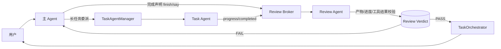
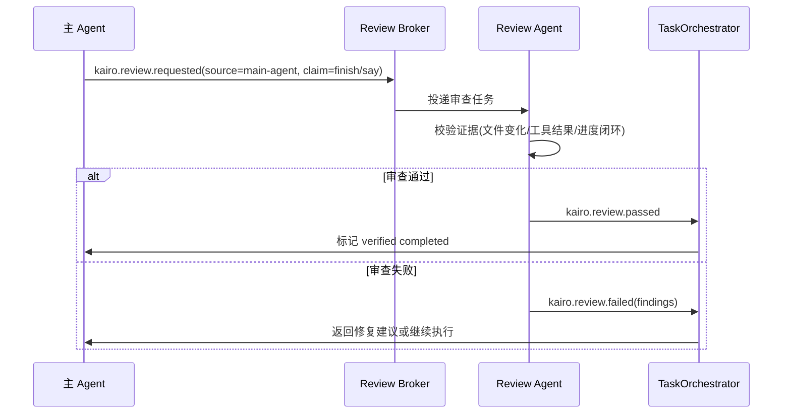
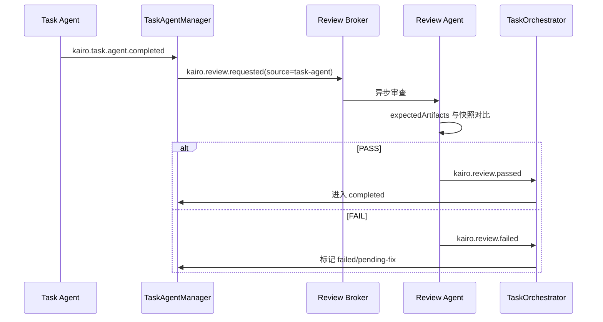

# 主 Agent 防误判完成审查方案

## 背景与目标

当前系统已经有 Task Agent 委派机制，但仍存在以下风险：

1. 主 Agent 可能在证据不足时直接 `finish`，形成“误以为已完成”。
2. Task Agent 交付物可能未更新，但上游仍被标记为已完成。
3. 主 Agent 的“主动检查”目前主要依赖提示词约束，缺少硬性校验闭环。

本方案目标是引入一个**非阻塞 Review Agent**，同时覆盖主 Agent 与 Task Agent 的完成声明，确保“声明完成”与“验证完成”分离。

## 设计原则

1. 非阻塞：审查与执行并行，不阻塞主 Agent 正常响应用户。
2. 可追溯：所有审查动作事件化，可回放、可审计。
3. 低侵入：尽量复用现有 EventBus、TaskOrchestrator、Task 工具。
4. 可降级：审查失败时给出修复路径，而不是把系统卡死。

## 核心架构

## 状态模型

在已有任务状态基础上，新增审查维度：

- `completionClaimed`: 已声明完成（Agent 声称完成）
- `reviewStatus`: `pending | passed | failed`
- `reviewFindings`: 审查结论与失败原因
- `lastVerifiedAt`: 最近一次审查通过时间

说明：
- `Task.status=COMPLETED` 不再仅由 `finish` 触发，而由 `reviewStatus=passed` 触发。
- 对主 Agent 的“非任务型完成声明”也进入审查队列，至少进行一次轻量证据校验。

## 关键流程

### 流程 A：主 Agent 声明完成

### 流程 B：Task Agent 交付物审查（非阻塞）

## 审查规则（MVP）

### 主 Agent 规则

1. 若 `finish` 前没有可验证新证据，判定失败。
2. 若连续出现“已完成”但无进度增量，判定失败。
3. 若声称完成与工具结果冲突（例如工具失败），判定失败。

### Task Agent 规则

1. `expectedArtifacts` 路径必须存在且有更新时间变化。
2. 产物数量、最小大小、最近修改时间窗口满足约束。
3. `progress.current` 到达 `progress.total` 或达到任务定义完成阈值。

## 事件与接口建议

### 新增事件

- `kairo.review.requested`
- `kairo.review.passed`
- `kairo.review.failed`
- `kairo.review.stale_artifact`

### 新增工具（可选）

- `kairo_review_task_delivery`
  - 输入：`taskId`, `scope(main|task|all)`, `strict`
  - 输出：`status`, `findings`, `evidence`

## 与现有模块的集成点

1. `runtime.ts`
   - 拦截主 Agent `finish`，先发 `kairo.review.requested`，通过后再结束意图。
2. `task-agent-manager.ts`
   - `kairo.task.agent.completed` 到达后不直接“最终完成”，改为触发审查流程。
3. `task-orchestrator.ts`
   - 增加 `reviewStatus/reviewFindings` 字段与事件处理。
4. `agent.plugin.ts`
   - 注册审查工具并初始化 Review Broker/Review Agent。

## 落地计划

### Phase 1（最小可用）

1. 加入 `kairo.review.requested/passed/failed` 事件。
2. 主 Agent `finish` 改成“声明完成 -> 审查 -> 真完成”。
3. Task Agent completed 后增加产物更新时间校验。

### Phase 2（增强）

1. 引入 `expectedArtifacts` 结构化约束。
2. 增加自动重试与自动取消策略。
3. 输出审查指标（通过率、误判率、重试率）。

### Phase 3（治理）

1. 支持按任务类型动态切换审查强度。
2. 支持跨 Agent 统一审查策略中心。
3. 结合历史失败模式做智能预警。

## 预期收益

1. 降低“已完成但其实未完成”的误判概率。
2. 将“提示词约束”升级为“机制约束”。
3. 保持主 Agent 响应性，不牺牲交互体验。
4. 为后续自动化治理与可观测性打基础。
